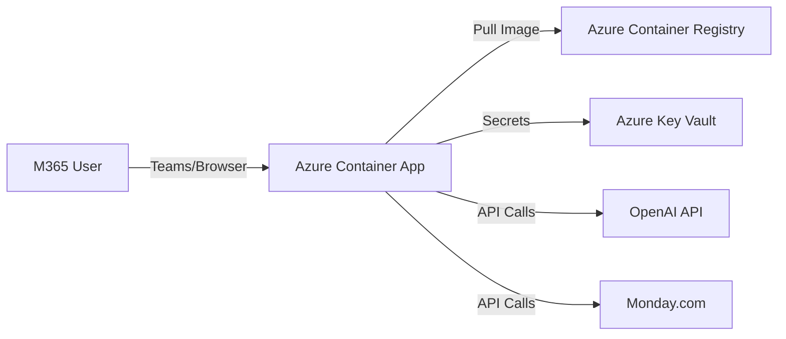

# ☁️ Deployment Guide: Microsoft 365 / Azure Ecosystem

**Target Environment:** Microsoft Azure (aligned with M365 E5)  
**Hosting Model:** Azure Container Apps (Serverless Containers)  
**Security:** Azure Entra ID (formerly AAD) & Key Vault

---

## 1. Architecture Overview

Since this is a Dockerized Python application, it fits perfectly into the **Azure Container Apps (ACA)** service. This provides a serverless, auto-scaling environment that integrates natively with your Microsoft 365 identity stack.



---

## 2. Prerequisites

*   **Azure Subscription** (Linked to your M365 Tenant).
*   **Azure CLI** installed (`az login`).
*   **Docker Desktop** installed.
*   **Resource Group** created (e.g., `rg-intake-agent`).

---

## 3. Step-by-Step Deployment

### Step A: Prepare the Container Registry
We need a private place to store your Docker image.

```bash
# 1. Create Registry
az acr create --resource-group rg-intake-agent --name acrintakeagent --sku Basic --admin-enabled true

# 2. Login
az acr login --name acrintakeagent
```

### Step B: Build & Push Image
Build the image locally and push it to Azure.

```bash
# 1. Build (Ensure you are in the project root)
# Note: Use linux/amd64 platform for Azure compatibility
docker build --platform linux/amd64 -t acrintakeagent.azurecr.io/intake-agent:v1 .

# 2. Push
docker push acrintakeagent.azurecr.io/intake-agent:v1
```

### Step C: Deploy to Azure Container Apps
Create the serverless environment.

```bash
# 1. Create Environment
az containerapp env create --name env-intake --resource-group rg-intake-agent --location eastus

# 2. Deploy App
az containerapp create \
  --name app-intake-agent \
  --resource-group rg-intake-agent \
  --environment env-intake \
  --image acrintakeagent.azurecr.io/intake-agent:v1 \
  --target-port 8501 \
  --ingress 'external' \
  --registry-server acrintakeagent.azurecr.io \
  --query properties.configuration.ingress.fqdn
```

---

## 4. Configuration (Secrets & Env Vars)

Never hardcode secrets. Use the Azure Portal to set environment variables securely.

1.  Go to **Azure Portal** -> **Container Apps** -> `app-intake-agent`.
2.  Select **Containers** -> **Edit and Deploy**.
3.  Under **Environment Variables**, add:
    *   `OPENAI_API_KEY`: `sk-...` (Select "Secret" reference)
    *   `PM_TOOL`: `monday`
    *   `MONDAY_API_KEY`: `...`
    *   `MONDAY_BOARD_ID`: `...`
    *   `SPACY_MODEL`: `en_core_web_lg` (Use Large model in cloud!)

---

## 5. Integration with Microsoft 365

### Option A: Embed in Microsoft Teams (Easiest)
You can make this tool available directly inside Teams.

1.  Copy the **Application URL** from Azure (e.g., `https://app-intake-agent.polartree.azurecontainerapps.io`).
2.  Open **Microsoft Teams**.
3.  Go to a **Team Channel**.
4.  Click **+ (Add Tab)** -> Select **Website**.
5.  Paste the URL and name it "Project Intake".
6.  *Result:* Users can access the agent without leaving Teams.

### Option B: Entra ID Authentication (SSO)
To restrict access to only your employees:

1.  Go to **Azure Container App** -> **Authentication**.
2.  Click **Add Identity Provider** -> **Microsoft**.
3.  Follow the wizard to create an App Registration.
4.  *Result:* Users must sign in with their M365 email to access the agent.

---

## 6. Maintenance

*   **Updates:** To update the code, just rebuild the Docker image (`v2`) and push it. Azure will automatically pull the new version if you update the revision.
*   **Logs:** View logs in the Azure Portal under **Log Stream** to debug issues.
